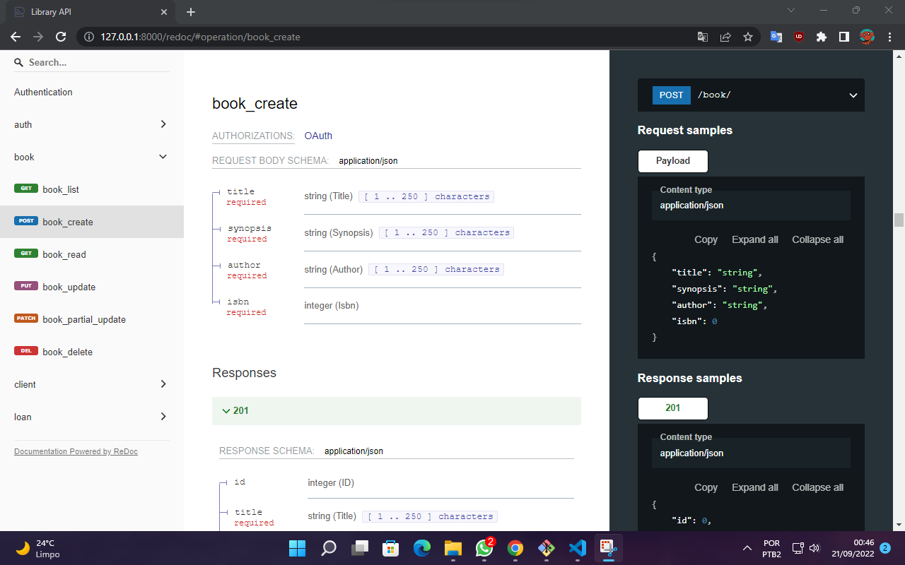

# About Library Management API

## Description

Web application developed with React JS and Django REST framework for library management.

The API has the following features: 
[1. Authentication.](#1-authentication) 
[2. Book Management](#2-book-management) 
[3. Client Management](#3-cleint-management) 
[4. Loan management](#4-loan-management) 

## Execution
This project was developed using the venv virtual environment, I recommend that you do the same to exult the project, to reduce the chances of error.

### 1. Installation of dependencies
Run the command `pip install -r requirements.txt` in your shell to install the required dependencies.

### 3. Database configuration

#### - SQLite Database
This project uses SQLite, to create the database and tables just run the following commands:  
`python manage.py makemigrations`  
`python manage.py migrate`

### 4. Run server
If the previous steps were successful, just run the command `python manage.py runserver` and open the URL http://127.0.0.1:8000/ in your browser, opening this URL will display the API documentation in your browser with Swagger. You can also access documentation with Redoc at http://127.0.0.1:8000/redoc/

## Website features
All functions for managing books, customers and loans require authentication.

### 1. Authentication
When logging in, the authentication token will be returned, which must be sent from the request header as follows:
`Authentication: Bearer token`
- User login
- User registration
- User data return
- Editing user data
- User account deletion

### 2. Book management
- Book registration.
- Editing book.
- Deleting book.
- Search by book.
- Listing of books.

### 3. Cleint management
- Register customer.
- Editing customer.
- Deleting customer.
- Search by customer.
- Listing of customers.

### 4. Loan management
- Register loan.
- Editing loan.
- Deleting loan.
- Search by loan.
- Listing of loan.

